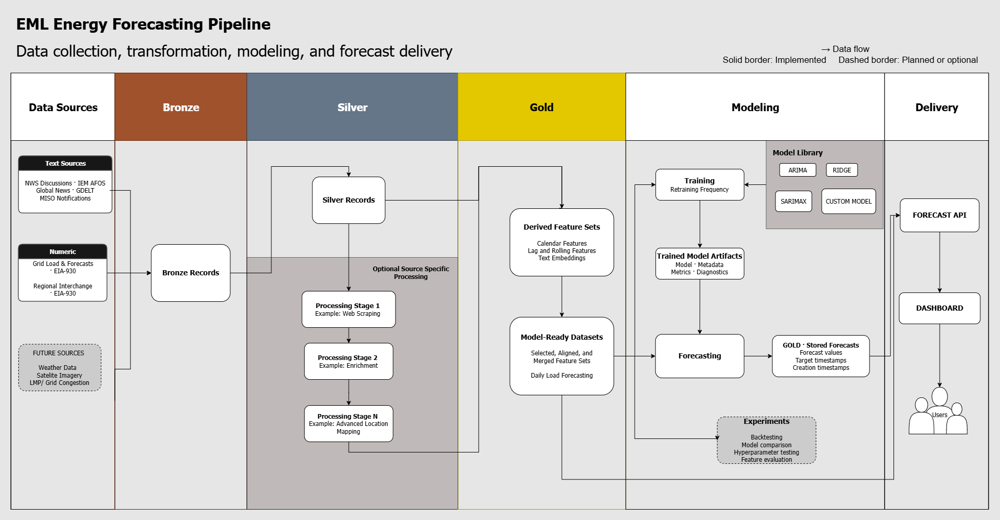

# Data Flow

This document explains how data moves through the EML Energy Forecasting Pipeline, from external sources to stored forecasts and user-facing applications.

It focuses on the sequence of processing stages. Component organization is documented in [Project Structure](project-structure.md), while physical storage conventions are documented in [Storage Layout](storage-layout.md).

## Pipeline Diagram



Solid borders represent implemented components. Dashed borders represent planned or optional components.

## High-Level Flow

The pipeline follows this general sequence:

```text
External Sources
    ↓
Bronze Records
    ↓
Silver Records
    ↓
Optional Source-Specific Processing
    ↓
Derived Feature Sets
    ↓
Model-Ready Datasets
    ↓
Training and Forecasting
    ↓
Stored Forecasts
    ↓
Forecast API and Applications
```

Numeric and textual sources share the same storage layers, but may follow different processing paths between Silver records and Gold data products.

## 1. Data Sources

The pipeline begins with external numeric and textual sources.

### Numeric Sources

Numeric sources provide time-series observations such as:

- Electricity demand
- Existing load forecasts
- Electricity generation
- Interchange between balancing authorities

Current examples include EIA-930 regional and interchange data.

### Text Sources

Text sources provide documents and event information that may contain useful forecasting signals.

Examples include:

- National Weather Service products
- MISO notifications
- GDELT articles
- News records
- Weather alerts

Additional sources, such as weather forecasts, satellite imagery, or market congestion data, may be added later.

## 2. Ingestion and Bronze Records

The ingestion stage retrieves records from external sources and writes them to the Bronze layer.

Bronze records preserve the original source response whenever practical. Only limited metadata needed for storage and processing may be added.

Ingestion may run in two modes:

- **Incremental ingestion** retrieves records that have become available since the previous successful run.
- **Historical ingestion** retrieves records over a specified historical period.

Preserving Bronze records allows later stages to reprocess data without requesting it from the external source again.

## 3. Standardization and Silver Records

The standardization stage reads Bronze records and converts them into shared Silver schemas.

The pipeline uses standardized structures for two broad categories of records:

- Numeric observations
- Text documents

Standardization creates consistent fields for information such as:

- Record identifiers
- Source names
- Observation or publication times
- Retrieval times
- Numeric values or document text
- Regions and other dimensions
- Source metadata

After standardization, downstream stages can work with consistent records without needing to understand every source's original response format.

## 4. Source-Specific Processing

Some Silver records require additional processing before they can be used to create features.

This processing is optional and depends on the source.

For example, text records may pass through several enrichment steps:

1. Retrieve the full article or document text.
2. Clean and validate the retrieved content.
3. Extract additional metadata.
4. Apply source-specific enrichment or mapping.
5. Convert the processed text into embeddings.

Numeric records may pass directly from Silver into feature generation when no additional enrichment is required.

Source-specific processing may therefore contain one step, several steps, or no additional steps at all.

## 5. Derived Feature Sets

Feature-building stages convert standardized or enriched records into reusable Gold feature sets.

Numeric feature sets may include:

- Calendar features
- Lagged values
- Rolling statistics
- Hourly measurements
- Daily aggregates
- Regional load and generation variables
- Interchange totals

Text-derived feature sets may include:

- Document embeddings
- Aggregated embedding features
- Categories or extracted attributes
- Other numeric representations of textual information

Feature sets remain separate when they represent different sources or transformation processes. This allows them to be reused across multiple datasets.

**Note:** Multiple feature sets can be derived from one silver data source such as daily and hourly load feature sets derived from hourly load  

## 6. Model-Ready Datasets

Dataset-building stages combine one or more feature sets into tables designed for a particular forecasting task.

A dataset builder may:

- Select the required feature sets
- Align records by timestamp and region
- Merge related variables
- Select the prediction target
- Validate the resulting observations
- Produce an hourly or daily modeling table

For example, a load-forecasting dataset may combine regional electricity features with interchange features using a shared observation time and region.

A model-ready dataset is specific to a forecasting task, while its underlying feature sets may be reused elsewhere.

## 7. Model Training

The training stage uses historical model-ready data to fit a configured forecasting model.

Training generally involves:

1. Loading the configured dataset.
2. Selecting the target and feature columns.
3. Applying the configured training and validation windows.
4. Fitting the selected model.
5. Evaluating predictions on validation data.
6. Storing the trained model and its metadata.

The model library may include statistical, machine-learning, and project-specific forecasting implementations.

Training does not necessarily occur during every pipeline run. A model can be reused until its configured retraining condition is met.

## 8. Model Artifacts

Training produces a model artifact and accompanying metadata.

The stored output may include:

- The fitted model
- Model type
- Target variable
- Expected feature columns
- Hyperparameters
- Training period
- Validation period
- Evaluation metrics
- Creation time

These artifacts allow the forecasting stage to load a previously trained model and reconstruct the inputs it expects.

## 9. Forecast Generation

The forecasting stage combines a trained model with the most recent available input data.

The stage generally:

1. Loads the trained model and metadata.
2. Loads the configured forecast dataset.
3. Constructs the required forecast inputs.
4. Generates predictions for future target times.
5. Writes the results to the Gold layer.

Forecast preparation may also create deterministic future features, such as calendar variables, and carry forward appropriate exogenous values when required by the model.

## 10. Stored Forecasts

Forecasts are stored as time-indexed Gold records.

Each forecast identifies at least two important times:

- **Creation time** — when the forecast was generated
- **Target time** — the future time being predicted

Keeping both timestamps allows the system to preserve multiple forecast vintages for the same target time.

Stored forecasts can therefore support:

- Selecting the latest available forecast
- Comparing successive forecast runs
- Plotting forecast curves
- Evaluating forecasts against later observations
- Comparing model performance over time

Forecast records also identify the model and target associated with each prediction.

## 11. Forecast Delivery

The Forecast API reads stored results and makes them available to external applications.

The API may provide access to:

- Available data sources
- Stored datasets
- Model definitions and parameters
- Forecast records
- Forecast creation and target times

A dashboard or other external application can request this information without directly accessing the underlying storage backend.

The delivery path is:

```text
Stored Forecasts
    ↓
Forecast API
    ↓
Dashboard or External Application
    ↓
Users
```

## Text and Numeric Processing Paths

The two primary data paths can be summarized as follows.

### Numeric Path

```text
Numeric Source
    ↓
Bronze Records
    ↓
Standardized Numeric Records
    ↓
Numeric Feature Sets
    ↓
Model-Ready Dataset
    ↓
Training or Forecasting
```

### Text Path

```text
Text Source
    ↓
Bronze Records
    ↓
Standardized Text Records
    ↓
Optional Scraping and Enrichment
    ↓
Text Embeddings or Other Text Features
    ↓
Model-Ready Dataset
    ↓
Training or Forecasting
```

The paths converge when their derived feature sets are combined into a common model-ready dataset. 

> **Composable processing stages**
>
> Each pipeline stage has clearly defined inputs and outputs. This allows new sources to introduce source-specific enrichment steps without changing the rest of the data flow. Additional stages can be inserted between standardization and feature generation as needed.

## Experiments and Evaluation

Model-ready datasets and stored forecasts can also support experimental workflows such as:

- Backtesting
- Model comparison
- Hyperparameter testing
- Feature evaluation
- Forecast-error analysis

These workflows use the same datasets, models, and stored forecast structure as the operational pipeline but are separate from scheduled forecast generation.

Some experimental capabilities remain planned or under development.

## Stage Summary

| Stage | Input | Output |
|---|---|---|
| Ingestion | External source | Bronze records |
| Standardization | Bronze records | Silver records |
| Source-specific processing | Silver records | Enriched records |
| Embedding | Standardized or enriched text | Text feature sets |
| Feature building | Silver or enriched records | Derived feature sets |
| Dataset building | One or more feature sets | Model-ready dataset |
| Training | Historical model-ready dataset | Model artifact and metadata |
| Forecasting | Model artifact and current inputs | Stored forecast records |
| Delivery | Stored datasets and forecasts | API responses |

## Related Documentation

- [Architecture Overview](overview.md) — Major system components and their relationships
- [Project Structure](project-structure.md) — Organization of code and supporting files
- [Storage Layout](storage-layout.md) — Dataset references, paths, and file organization
- [Design Principles](design-principles.md) — Principles guiding the architecture
- [AWS Deployment](aws-deployment.md) — Production execution and infrastructure
- [Pipeline Documentation](../pipelines/) — Detailed behavior of individual stages